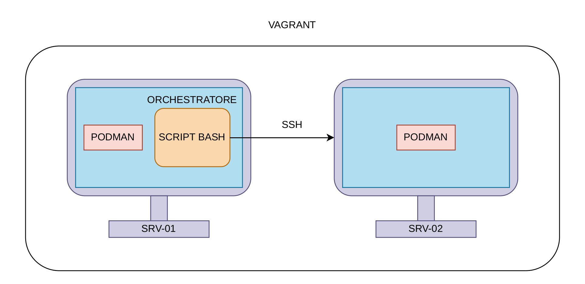

# PingPong di container con Podman

## Architettura

<p aligne="center">
    
</p>

L'infrastruttura è composta da due VM provisionate con **Vagrant**, ciascuna con **Podman** installato.

- **Nodo locale (orchestratore)**:
  - `192.168.56.11` 
  - esegue lo `script`
- **Nodo remoto (worker)**:
  - IP: `192.168.56.12` 
  - riceve ed esegue i comandi `podman` via SSH

Il modello prevede un'**orchestrazione centralizzata**: un unico nodo gestisce l'avvio e l'arresto dei container, assicurando che ne sia attivo uno solo alla volta attraverso intervalli di esecuzione predefiniti

## Funzionamento

Inizialmente viene effettuato lo scambio delle chiavi SSH tramite la directory condivisa con l'host:

- Per generare le chiavi viene utlizzato il comando:

```bash
ssh-keygen -t ed25519 -N ""
```

- Lo scambio di chiavi avviene in due passaggi:

1. La chiave pubblica del `nodo1` viene copiata nella cartella condivisa con l'host

```bash
# nodo1
cp /root/.ssh/id_ed25519.pub /condivisa/rocky1.pub
```

2. Successivamente viene aggiunta al file authorized_keys del `nodo2`

```bash
# nodo2
cat /condivisa/rocky1.pub >> /root/.ssh/authorized_keys
```

Infine viene avviato lo script

## Avvio

All'avvio viene mostrata una breve animazione di caricamento, poi il menu principale:

```bash
 ===== Menu principale =====
 1) Crea un container per il pingpong  
 2) Elimina un container  
 3) Avvia il pingpong  
 4) Visualizza informazioni su un container 
 5) Esci
 ``` 

### 1) Creazione container

#### Descrizione

Crea un container basato sull'immagine `alpine` con comando `sleep 60`. 

#### Funzionamento
Viene richiesto di scegliere se creare il container sul nodo locale o sul nodo remoto. Successivamente, viene richiesto di specificare il nome del container

### 2) Eliminazione container

#### Descrizione

Elimina un container da un nodo locale o remoto.

#### Funzionamento

Viene richiesto di scegliere se eliminare un container sul nodo locale o sul nodo remoto. Successivamente, mostra la lista dei container disponibili chiede il nome del container da rimuovere. Infine, verifica che esista e procede con l'eliminazione.

### 3) Avvio pingpong

#### Descrizione

Può essere avviato in due modalità:

- **Pingpong infinito**: alterna i due container senza fine (interrompibile con `CTRL+C`).
- **Pingpong per `n` volte**: alterna i due container il numero di volte indicato dall'utente.

In entrambi i casi:
- mostra l’elenco dei container locali e richiede di selezionarne di uno
- mostra l’elenco dei container remoti e richiede di selezionarne di uno
- Viene richiesto l'intervallo di passaggio (MAX 60 secondi)

Nel caso del pingpong per n volte, viene richiesto anche il numero di passaggi da eseguire

#### Funzionamento

Ciclo eseguito:

1. Avvia il container locale → attesa `temp` secondi → lo ferma.
2. Avvia il container remoto via SSH → attesa `temp` secondi → lo ferma.
3. Ripete (all'infinito o fino a `n`).

### 4) Informazioni container

#### Descrizione

Mostra informazioni su container locali o remoti

#### Funzionamento

Viene richiesto di scegliere se visualizzare informazioni su un container locale o remoto. Successivamente, viene mostrato un menù dove selezionare l'informazione che vogliamo visualizzare. Permette di visualizzare: ID, data di creazione, immagine, stato e comando.

## Funzioni utilizzate

- **`verifica_3opt`**: valida che la selezione nei sottomenù sia un valore tra 1 e 3.
- **`checkloc` / `checkrem`**: verificano l'esistenza del container (locale/remoto) prima di operare.
- **`load`**: animazione di caricamento iniziale.
- **`chiusura_for`**: gestore del segnale `SIGINT` (CTRL+C); forza l'arresto dei container in esecuzione su entrambi i nodi e termina lo script in modo pulito.

## Gestione degli interrupt

Lo script imposta un `trap` su `SIGINT`: premendo `CTRL+C` durante un pingpong, entrambi i container (locale e remoto) vengono fermati con `podman kill` prima dell'uscita, evitando di lasciare container orfani in esecuzione.
