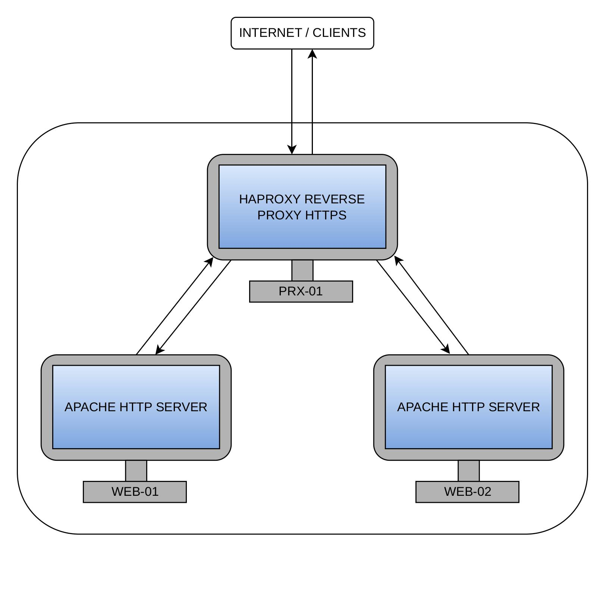

  # REVERSE PROXY

## ARCHITETTURA

<p aligne="center">
    
</p>

## MACCHINA PRX-01
Questa macchina funziona come reverse proxy: il traffico passa prima da lei, che fa da intermediario tra il client e i server a cui inoltra le richieste. Inizialmente è stata configurata in HTTP e successivamente in HTTPS per crittografare la comunicazione tra client e server.
### Configurazione 
- Sistema operativo: Ubuntu Jammy 64 bit
- Hostname: PRX-01
- Memoria RAM: 1024 MB
- CPU: 1 core
- Network: interfaccia di rete privata
  -  IP statico: 192.168.56.11
- Pacchetti installati: HAProxy
- Port forwarding (utilizzato per controllare il corretto funzionamento dell'esercizio):
  - Host: porta 8080
  - Guest: porta 443
### Funzionamento
Dopo l'installazione del pacchetto HAProxy, è stato configurato il file haproxy.cfg che si trova nella directory /etc/haproxy:

```bash
global
    daemon
    log /dev/log local0

defaults
    mode http
    log global
    option forwardfor
    timeout connect 5s
    timeout client 30s
    timeout server 30s


frontend esempio
    bind *:80 

    acl scuola path_beg /scuola
    acl lavoro path_beg /lavoro

    use_backend WEB-01 if scuola
    use_backend WEB-02 if lavoro

    http-request deny unless scuola or lavoro

backend WEB-01
    server WEB-01 192.168.56.12:80 check

backend WEB-02
    server WEB-02 192.168.56.13:80 check
```
---
#### GLOBAL
La sezione global contiene le impostazioni generali di HAProxy. In questo caso:

```bash
global
    daemon
    log /dev/log local0
```
- daemon: avvia HAProxy in modalità background
- log /dev/log local0: serve a dire ad HAProxy dove e come inviare i log di sistema
#### DEFAULT
La sezione defaults definisce i parametri predefiniti che vengono applicati a tutte le sezioni successive:

```bash
defaults
    mode http
    log global
    option forwardfor
    timeout connect 5s
    timeout client 30s
    timeout server 30s
```

- mode http: mette HAProxy in modalità HTTP
- log global: utilizza le impostzioni di log definite nella sezione global
- option forwardfor: serve a far passare ai server backend l’IP reale del client
- timeout connect 5s: indica il tempo massimo per stabilire una connessione con il server backend.
- timeout client 30s: indica il tempo massimo di inattività consentito per il client
- timeout server 30s: indica il tempo massimo di inattività consentito per il server backend
#### FRONTEND HTTP
La sezione frontend definisce il punto da cui entra il traffico e dove HAProxy decide come gestire le richieste in arrivo.

```bash
frontend esempio
    bind *:80

    acl scuola path_beg /scuola
    acl lavoro path_beg /lavoro

    use_backend WEB-01 if scuola
    use_backend WEB-02 if lavoro

    http-request deny unless scuola or lavoro
```

- bind *:80: indica che il frontend è in ascolto su tutte le interfacce di rete sulla porta 80.
- acl scuola path_beg /scuola: Crea una regola chiamata “scuola” che si attiva quando il percorso dell’URL inizia con /scuola
- acl lavoro path_beg /lavoro: Crea una seconda regola chiamata “lavoro” che si attiva quando il percorso dell’URL inizia con /lavoro
- use_backend WEB-01 if scuola: inoltra le richieste al backend WEB-01 se è soddisfatta la condizione della ACL scuola.
- use_backend WEB-02 if lavoro: inoltra le richieste al backend WEB-02 se è soddisfatta la ACL lavoro.
- http-request deny unless scuola or lavoro: blocca tutte le richieste che non rispettano nessuna delle due condizioni.
#### FRONTEND HTTPS
Per rendere il frontend HTTPS c'è bisogno della coppia certificato/chiavi privata (TLS). Come primo passo si generano la coppia di chiavi rsa:

```bash
openssl genrsa -out esempio.key 2048
```
Questo genera la chiave privata RSA a 2048 bit. Successivamente si genera la CSR(Certificate Signing Request):

```bash
openssl req -new -key esempio.key -out esempio.csr
```

La CSR contiene:
- La chiave pubblica
- I metadati inseriti
- Una firma digitale fatta con la chiave privata

Successivamente dato che non abbiamo una CA, si genera un certificato self-signed firmato con la nostra chiave privata:

```bash
openssl x509 -req -days 365 -in esempio.csr -signkey esempio.key -out esempio.pem
```
HAproxy richiede che la chiave ed il certificato siano contenuti in un unico file. Per questo si utilizza il comando:

```bash
cat esempio.pem esempio.key > esempioproxy.pem
```

Infine bisogna dire ad HAProxy dove trovare il file del certificato e quindi si rientra nel file haproxy.cfg e si scrive:

```bash
frontend esempio_ssl
    bind *:443 ssl crt /etc/ssl/mycerts/esempioproxy.pem
```
#### BACKEND
La sezione backend definisce a quali server HAProxy deve mandare le richieste che arrivano dal frontend.

```bash
backend WEB-01
    server scuola 192.168.56.12:80 check

backend WEB-02
    server lavoro 192.168.56.13:80 check
```

La direttiva check permette ad HAProxy di controllare periodicamente lo stato dei server del backend, verificando che siano attivi e raggiungibili.

---
Completata la configurazione, il servizio HAProxy viene riavviato per applicare le modifiche con il comando:

```bash
systemctl restart haproxy
```
## MACCHINA WEB-01 E WEB-02
Queste macchine funzionano come server WEB
### Configurazione 
- Sistema operativo: Ubuntu Jammy 64 bit
- Hostname: WEB-01 / WEB-02
- Memoria RAM: 1024 MB
- CPU: 1 core
- Network: interfaccia di rete privata
  -  IP statico WEB-01: 192.168.56.12
  -  IP statico WEB-02: 192.168.56.13
- Pacchetti installati: apache2
### Funzionamento
Dopo aver installato Apache2 e configurato il server web in /var/www/html, bisogna creare una sottocartella con il path definito nelle ACL:

```bash
acl scuola path_beg /scuola
acl lavoro path_beg /lavoro
```

 /scuola nel caso di WEB-01 e /lavoro nel caso di WEB-02.
 
  In entrambe va inserito il file index.html in quanto quando si visita l'indirizzo https://192.168.56.11/scuola, Apache parte dalla DocumentRoot e aggiunge il path, andando quindi a cercare l'index.html nella cartella /var/www/html/scuola.